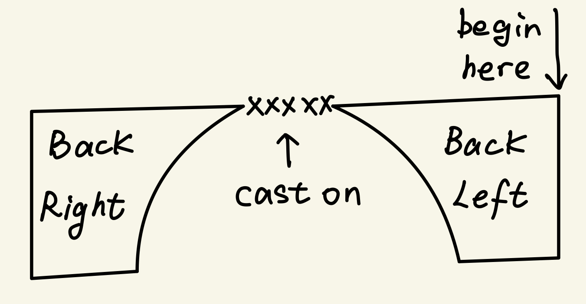
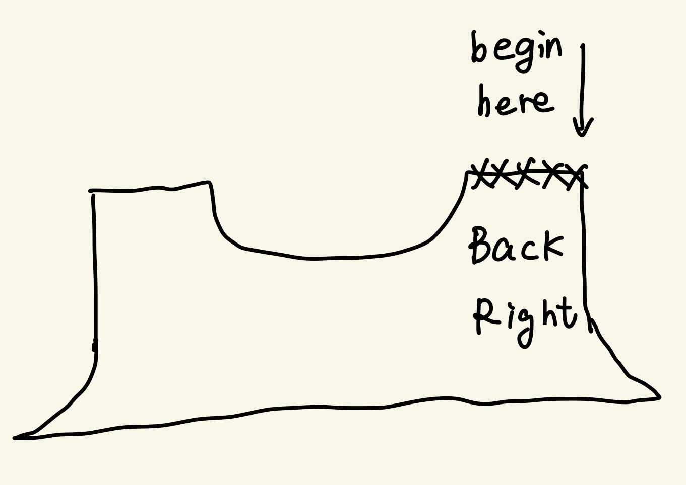
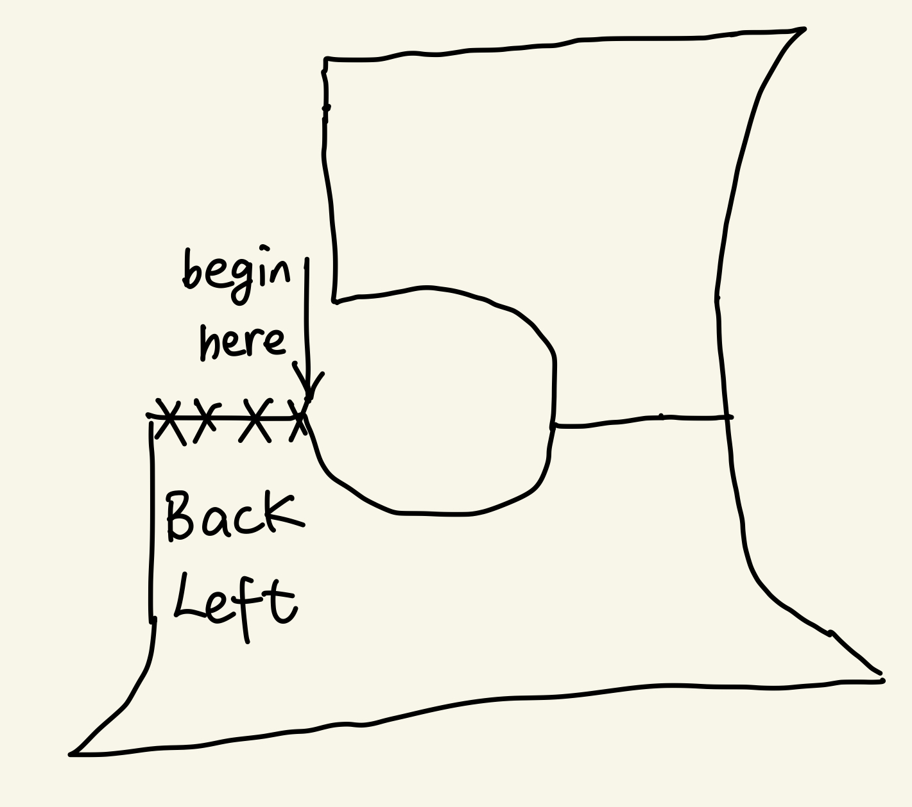
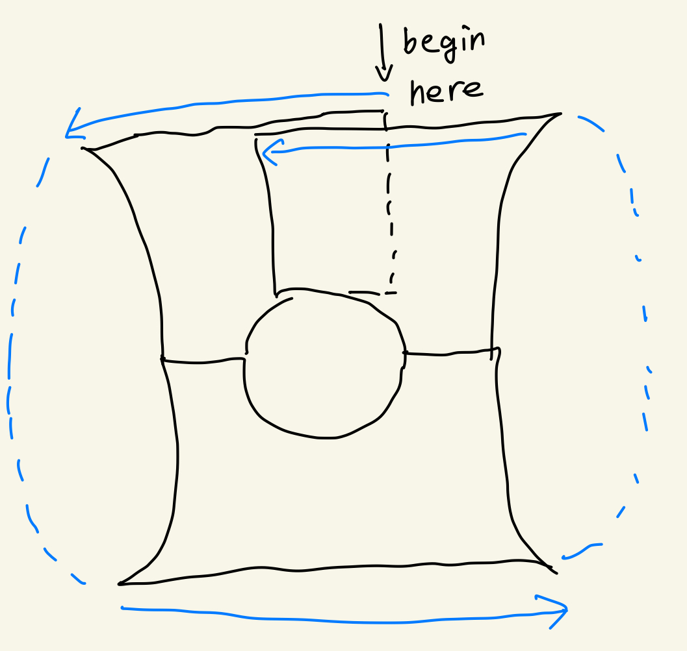
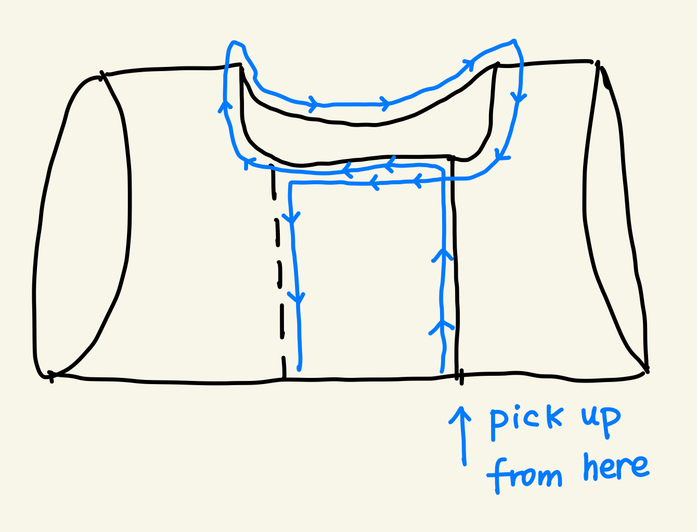

# Oh It's Wool

## Made-to-Measure Bolero Free Pattern

This pattern was generated from your measurements.

> **Pattern use and disclaimer**
>
> Please do not sell, copy, redistribute, upload, translate, or claim this pattern, its instructions, or its photos as your own. This applies even though the pattern is free.
>
> Please share a link to the original pattern instead of reposting it.
>
> You may sell a small number of finished, handmade pieces made from this pattern. Please credit **Oh It's Wool (@ohitswool)** as the designer.

| Measurement | Value |
|---|---:|
| Bust | {bust} cm |
| Shoulder seam width | {shoulder} cm |
| Armhole | {armhole} cm |
| Upper arm circumference | {upperArm} cm |
| Gauge Across | {gaugeAcrossSts} sts / {gaugeAcrossCm} cm |
| Gauge Down | {gaugeDownRows} rows / {gaugeDownCm} cm |

---

## Back Right

[Long tail cast on](https://www.youtube.com/shorts/7DQgHLIHeF8) **{backCastOnSt} sts**.

Repeat the following rows until you have worked **{backStraightRows} rows** in total.

- **WS:** P all sts.
- **RS:** K all sts.

Repeat the following rows for **{backIncRows} rows**.

- **WS:** P all sts.
- **RS:** K2, LLI, K to end of row.

Repeat the following rows for **{backFastIncRows} rows**, finishing with a WS row.

- **WS:** P to 2 sts before end of row, RLIP, P2.
- **RS:** K2, LLI, K to end of row.

> Place all sts on hold. Break the yarn, leaving a long tail to weave in later.

---

## Back Left

[Long tail cast on](https://www.youtube.com/shorts/7DQgHLIHeF8) **{backCastOnSt} sts**.

Repeat the following rows until you have worked **{backStraightRows} rows** in total.

- **WS:** P all sts.
- **RS:** K all sts.

Repeat the following rows for **{backIncRows} rows**.

- **WS:** P all sts.
- **RS:** K to 2 sts before end of row, RLI, K2.

Repeat the following rows for **{backFastIncRows} rows**, finishing with a WS row.

- **WS:** P2, LLIP, P to end of row.
- **RS:** K to 2 sts before end of row, RLI, K2.

> Do not break the yarn.

---

## Join Back Right and Back Left

Join the two back panels as follows:

- **Back Left:** Turn work, so it is now an RS row. K to 2 sts before end of row, RLI, K2.
- **Cast on:** Using the [backward-loop cast-on method](https://www.youtube.com/shorts/ssOZa5XrIfE), cast on **{backCenterCastOnSt} sts**.
- **Back Right:** Continue across the Back Right panel: K2, LLI, K to end of row.

Turn work.
Repeat the following rows for **{backArmholeStraightRows} rows**.

- **WS:** P all sts.
- **RS:** K all sts.

Repeat the following rows for **{armholeIncRows} rows**.

- **WS:** P all sts.
- **RS:** K2, LLI, K to 2 sts before the end of the row, RLI, K2.

Repeat the following rows for **{armholeFastIncRows} rows**, finishing with a WS row.

- **WS:** P2, LLIP, P to 2 sts before the end of the row, RLIP, P2.
- **RS:** K2, LLI, K to 2 sts before the end of the row, RLI, K2.

> Place all sts on hold. Break the yarn, leaving a long tail to weave in later.

---

## Front Right (Buttonhole Side)

With RS facing you, pick up **{backCastOnSt} sts** from the Back Right shoulder.

Repeat the following rows until you have worked **{frontStraightRows} rows** in total.

- **WS:** P all sts.
- **RS:** K all sts.

Repeat the following rows for **{frontIncRows} rows**.

- **WS:** P all sts.
- **RS:** K to 2 sts before end of row, RLI, K2.

Repeat the following rows for **{frontFastIncWorkRows} rows**, finishing with an RS row.

- **WS:** P2, LLIP, P to end of row.
- **RS:** K to 2 sts before end of row, RLI, K2.

With the RS still facing:
- Place a buttonhole marker (SMB).
- Using the [backward-loop cast-on method](https://www.youtube.com/shorts/ssOZa5XrIfE), cast on **{frontCenterBeforeBandSt} sts**.
- Place a buttonhole marker (SMB).
- Using the [backward-loop cast-on method](https://www.youtube.com/shorts/ssOZa5XrIfE), cast on **{buttonBandSt} sts**.

> **Buttonhole guide**
>
> **Suggested rows:** Count from the first row after the center cast-on. Around Rows {firstButtonholeRow} and {secondButtonholeRow}, choosing an RS row.
>
> You can choose how many rows of buttons to add and adjust the spacing to suit your preference.
>
> **At each SMB:** Follow the row's other shaping instructions as established. When you reach an SMB, slip SMB, YO, then K2tog.

- **WS:** P all sts.
- **RS:** K to 4 sts before the end of the row, P1, K1, P1, K1.

Repeat the following rows for **{frontRightArmholeStraightRows} rows**.

- **WS:** P1, K1, P1, K1, P to the end of the row.
- **RS:** K to 4 sts before the end of the row, P1, K1, P1, K1.

Repeat the following rows for **{armholeIncRows} rows**.

- **WS:** P1, K1, P1, K1, P to the end of the row.
- **RS:** K2, LLI, K to 4 sts before the end of the row, P1, K1, P1, K1.

Repeat the following rows for **{armholeFastIncRows} rows**, finishing with a WS row.

<!-- AUTHOR NOTE: Check whether this section should finish with an RS row and whether armholeFastIncRows should be even or odd. It is currently forced to be even in formulas.js. -->

- **WS:** P1, K1, P1, K1, P to 2 sts before the end of the row, RLIP, P2.
- **RS:** K2, LLI, K to 4 sts before the end of the row, P1, K1, P1, K1.

> Place all sts on hold. Break the yarn, leaving a long tail to weave in later.
---

## Front Left (Button Side)

Pick up **{backCastOnSt} sts** from the Back Left shoulder.

Repeat the following rows until you have worked **{frontStraightRows} rows** in total.

- **WS:** P all sts.
- **RS:** K all sts.

Repeat the following rows for **{frontIncRows} rows**.

- **WS:** P all sts.
- **RS:** K2, LLI, K to end of row.

Repeat the following rows for **{frontFastIncRows} rows**, finishing with a WS row.

- **WS:** P to 2 sts before end of row, RLIP, P2.
- **RS:** K2, LLI, K to end of row.

With the WS still facing, use the [backward-loop cast-on method](https://www.youtube.com/shorts/ssOZa5XrIfE) to cast on **{frontCenterCastOnSt} sts**.

- **RS:** K all sts.

> **Button position guide**
>
> **Suggested rows:** Counting from the cast-on, choose an RS row near Rows {firstButtonholeRow} and {secondButtonholeRow}.
>
> **Mark positions:** With the front facing, count from the right edge. Place the first marker after **{buttonBandSt} sts**. Count **{frontCenterBeforeBandSt} more sts** and place the second marker.
>
> **Your choice:** If you chose a different number or placement of buttonholes, mark the matching button positions.

Repeat the following rows for **{frontArmholeStraightRows} rows**.

- **WS:** P to 4 sts before the end of the row, K1, P1, K1, P1.
- **RS:** K1, P1, K1, P1, K to the end of the row.

Repeat the following rows for **{armholeIncRows} rows**.

- **WS:** P to 4 sts before the end of the row, K1, P1, K1, P1.
- **RS:** K1, P1, K1, P1, K to 2 sts before the end of the row, RLI, K2.

Repeat the following rows for **{armholeFastIncRows} rows**, finishing with a WS row.

- **WS:** P2, LLIP, P to 4 sts before the end of the row, K1, P1, K1, P1.
- **RS:** K1, P1, K1, P1, K to 2 sts before the end of the row, RLI, K2.

> Do not break the yarn.

---

## Join Front Left, Back and Front Right
Connect the panels as follows:

- **RS:** Knit across the Front Left panel, Back panel, and Front Right panel.

Repeat the following rows to your desired length, end with a WS row. In my bolero samples, I worked **3 rows**.

- **WS:** P1, K1, P1, K1, P to 4 sts before the end of the row, K1, P1, K1, P1.
- **RS:** K1, P1, K1, P1, K to 4 sts before the end of the row, P1, K1, P1, K1.

To add more buttons, add buttonhole, at each buttonhole SMB, slip SMB, YO, K2tog, while following the established row instructions.

> Keep all sts alive on the needle (needle A). Break the yarn, leaving a long tail to weave in later.

---

## Ribbing

With the RS facing, transfer **{leftFrontHoldSt} Front Left sts** from Needle A to a separate needle (**Needle B**).

Starting at the center of the left underarm, attach the yarn. Using the right tip of **Needle A**, knit across the Back until **{frontCenterCastOnSt} Front Right sts** remain on the left tip.

Arrange the needles for a [three-needle join](https://www.youtube.com/watch?v=9MXIccZnqdo):

- In your left hand, hold the left tip of Needle A in front and Needle B behind.
- Hold the right tip of Needle A in your right hand.

Join the overlapping Front Right and Front Left layers as follows:

- K2tog using 1 st from the left tip of Needle A and 1 st from Needle B.
- Repeat **{frontCenterCastOnSt} times**, keeping the joined sts live on the right tip of Needle A.

- Knit the remaining sts from Needle B onto Needle A.

You are now back at the center of the left underarm.

Switch to needles **1 mm smaller** and work **2 × 2 ribbing** in the round to your desired length (I knit for **1 inch / 2.5 cm**).

Bind off using a stretchy method. An Italian bind-off is recommended.

## Neckline I-Cord Edging

> **Pickup guide**
>
> **Vertical edges:** Based on your gauge, pick up **{neckPickupSt} sts for every {neckPickupRows} rows**.
>
> **Horizontal edges:** Pick up **1 st in every st**.

Pick up sts around the neckline opening using the guide above and the direction shown below.

[Knitted cast on](https://www.youtube.com/shorts/XHlFvhqIyeo) **3 sts**.
Work back along the neckline. Repeat until all picked-up sts have been worked:

- **Along the edge:** K2, K2tog, then slip the 3 sts back to the left needle.
- **At each sharp corner:** K3, then slip the 3 sts back to the left needle.

Using the [I-cord bind-off method](https://www.youtube.com/shorts/ZW4afVEPpJA), bind off the remaining 3 sts and leave a long tail.

Using the yarn tail, sew the end of the I-cord securely to the garment.

## Sleeves

### Work the sleeves separately

Cast on **{sleeveCastOnSt} sts** and join to work in the round. K for **{sleeveStraightRounds} rounds** . place SM1 to label the start of the round. and SM2  to label the half middle.

Begin the German short-row shaping:

- **RS:** K to SM2, slip SM2, K **{sleeveFirstRSExtraSt} sts**, turn, and work a GSR.
- **WS:** P **{sleeveFirstWSSt} sts**, turn, and work a GSR.

Repeat the following rows until **{sleeveStBeforeMarker} sts** remain before the SM1 at the end of the WS row.

- **RS:** K to the previous short-row stitch, work that stitch, K **{sleeveShortRowStepSt} sts**, turn, and work a GSR.
- **WS:** P to the previous short-row stitch, work that stitch, P **{sleeveShortRowStepSt} sts**, turn, and work a GSR.

Repeat the following rows for **{sleeveShortRowRepeats} rows**.

- **RS:** K to **{sleeveShortRowStepSt} sts** before the previous short-row stitch, turn, and work a GSR.
- **WS:** P to **{sleeveShortRowStepSt} sts** before the previous short-row stitch, turn, and work a GSR.

On the next RS row, K all sts.

### Form the Sleeve-Cap Pleats

> **Important:** Please watch the [knitted box-pleat tutorial](https://www.youtube.com/watch?v=tSkKQrhXs-I) before you begin, as the stitches must be arranged in a very specific way.

K to **{sleevePleatSt} sts before SM2**.

Work the two sides of the box pleat as follows.

**Right side — before SM2**

1. Slip the next **{sleevePleatGroupSt} sts** purlwise onto Needle A.
2. Slip the following **{sleevePleatGroupSt} sts** purlwise onto Needle B.
3. Fold Needles A and B in front of the main needle, with Needle A closest to you.
4. K3tog using 1 st from Needle A, 1 st from Needle B, and 1 st from the main needle. Work this K3tog **{sleevePleatGroupSt} times**.

**Center**

Slip SM2.

**Left side — after SM2**

1. Slip the next **{sleevePleatGroupSt} sts** purlwise onto Needle A.
2. Slip the following **{sleevePleatGroupSt} sts** purlwise onto Needle B.
3. Fold Needles A and B behind the main needle, with Needle A farthest from you.
4. K3tog using 1 st from the main needle, 1 st from Needle B, and 1 st from Needle A. Work this K3tog **{sleevePleatGroupSt} times**.

K to SM1, then bind off using the standard method.

### Sew On the Sleeves

Attach each sleeve using the guide below.

> **Sleeve seaming guide**
>
> **Your counts:** {sleeveSeamEdgeSt} sleeve sts and {armholeEdgeRows} armhole rows.
>
> **Easy ratio:** {sleeveSeamEdgeSt}:{armholeEdgeRows}, approximately {roundedSleeveSeamSt}:{roundedArmholeRows}, simplifies to **{easySleeveSeamSt}:{easyArmholeRows}**.
>
> **How to sew:** **{easySleeveSeamSt} sleeve stitches per {easyArmholeRows} armhole rows.**
>
> **Most important:** Use this ratio only as a starting point. Trust how the fabric fits—the finished seam should be smooth and even, without puckering. You can pin or baste the sleeve to the underarm and shoulder first, then adjust the spacing to fit your actual knitted pieces.

#### Sleeve I-Cord Edging

Using a 0.5mm smaller needle , repeat around the sleeve cast-on edge:

- **Pickup:** Pick up 1 st, then skip the next st.

You should now have approximately **{sleevePickupSt} sts** on the needle.

Using the [knitted cast-on method](https://www.youtube.com/shorts/XHlFvhqIyeo), cast on **3 sts**.

Repeat the following step around the sleeve opening:

- **I-cord:** K2, K2tog, slip the 3 sts back to the left needle.

When all picked-up sts have been worked, you will have 3 sts live on the needle. Use the [grafted I-cord bind-off method](https://www.youtube.com/watch?v=4dQNueDp4O4&t=19s) to join the I-cord in the round.

---

## Finishing

Weave in all ends. Gently block the finished bolero to shape, allowing the seams and edges to settle.

> **Share your bolero**
>
> I would love to see what you make! If you post your bolero on Instagram, please tag **@ohitswool**.
>
> Follow **@ohitswool** for more patterns and knitting projects in the future.
